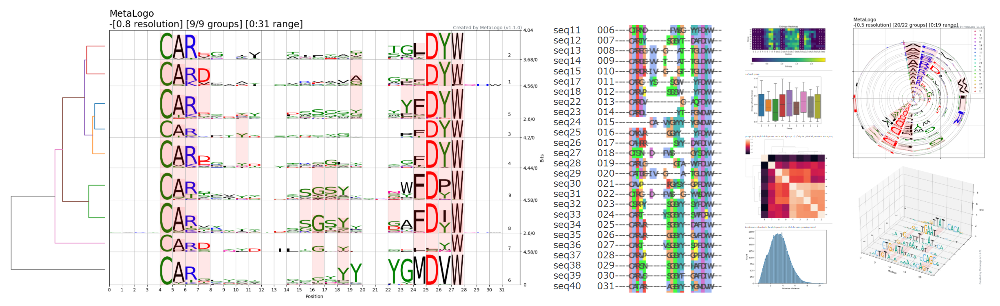

# MetaLogo

## Introduction

**MetaLogo** is a tool for making sequence logos. It can take multiple sequences as input, automatically identify the homogeneity and heterogeneity among sequences and cluster them into different groups given any wanted resolution, finally output multiple aligned sequence logos in one figure. Grouping can also be specified by users, such as grouping by lengths, grouping by sample Id, etc.  Compared to conventional sequence logo generator, MetaLogo can display the total sequence population in a more detailed, dynamic and informative view.

To use MetaLogo, you could visit our public webserver http://metalogo.omicsnet.org. You could also install MetaLogo as a python package to using MetaLogo in your python scripts or in your OS terminal. If you want to provide MetaLogo to people in your local network, you could also setup a webserver by using docker.

Please check the [tutorial](https://github.com/labomics/MetaLogo/wiki) for detailed usage of MetaLogo package and webserver.

## Install

Before you install MetaLogo, you could first set up a virtual environment for MetaLogo using conda:

    $conda create -n metalogo python=3.7
    $conda activate metalogo

Then, you can install MetaLogo using following commands:

    $git clone https://github.com/labomics/MetaLogo 
    $cd MetaLogo
    $pip install .

If succeed, you can run MetaLogo directly:

    $metalogo -h

If you want to using MetaLogo in your scripts, it is also very easy:

    from MetaLogo import logo
    sequences = [['seq1','ATACAGATACACATCACAG'],['seq2','ATACAGAGATACCAACAGAC'],['seq3','ATACAGAGTTACCCACGGAC']]

    bin_args = {
        'clustalo_bin':'../MetaLogo/dependencies/clustalo',
        'fasttree_bin':'../MetaLogo/dependencies/FastTree',
        'fasttreemp_bin':'../MetaLogo/dependencies/FastTreeMP',
        }

    lg = logo.LogoGroup(sequences,height_algorithm='probabilities',group_strategy='length', **args)
    lg.draw()

Note that the paths of clustal omega and fasttree bins should be given to MetaLogo, which are required for grouping.

MetaLogo also provide webserver to draw sequence logos without coding. For server setup, you need to install the required packages first.

    $pip install .[webserver]

You need to start a redis server and the redis queue servic before running the MetaLogo server locally (see [tutorial](https://github.com/labomics/MetaLogo/wiki/Install)). We recommend that you can build a docker container to provide the service:

    $cat MetaLogo/server.docker.sh
     docker build -t metalogo:v1 .
     docker run -d  --expose 8050 --name metalogo -e VIRTUAL_HOST=metalogo.omicsnet.org -v "$(pwd)":/code metalogo:v1 
    $sh MetaLogo/server.docker.sh
     ...
    $docker ps
     CONTAINER ID    IMAGE          COMMAND                  CREATED      STATUS      PORTS       NAMES
     ad598ca936df    metalogo:v1    "/bin/sh -c 'GUNICORN"   2 days ago   Up 2 days   8050/tcp    metalogo

Docker needs to be installed in the system before running the command. This command will build the Docker image and start a Docker container. You could set a [nginx-proxy](https://github.com/nginx-proxy/nginx-proxy) layer to redirect network requests to MetaLogo container or you can just simply use the MetaLogo docker to receive outside network traffic from your local network.

More detailed instructions please check the [tutorial](https://github.com/labomics/MetaLogo/wiki/Install) of MetaLogo.

## Citation

MetaLogo is currently in submission. Please remember to cite our work after MetaLogo get published.

Currently you can get a [preprint version of our manuscript](https://www.biorxiv.org/content/10.1101/2021.08.12.456038v3).

    MetaLogo: a generator and aligner for multiple sequence logos
    Yaowen Chen, Zhen He, Yahui Men, Guohua Dong, Shuofeng Hu, Xiaomin Ying
    bioRxiv 2021.08.12.456038; doi: https://doi.org/10.1101/2021.08.12.456038

