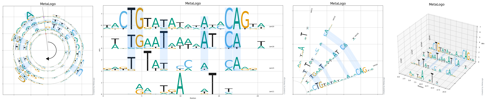
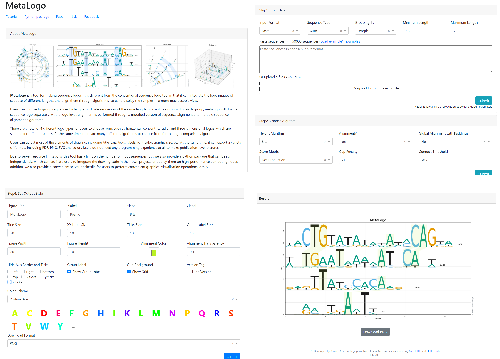

# MetaLogo

## Introduction

MetaLogo is a tool for making sequence logos. Unlike other sequence logo tools, MetaLogo allows you to input sequences with different lengths or from different groups, then it can plot multiple sequence logos in one figure and align the logos to highlight the conserved patterns among different sequence groups.

To use MetaLogo, you could visit our public webserver http://metalogo.omicsnet.org. You could also install MetaLogo as a python package to using MetaLogo in your python scripts or in your OS terminal. If you want to provide MetaLogo to people in your local network, you could also setup a webserver by using docker.

Please check the [tutorial](https://github.com/labomics/MetaLogo/wiki) for deWeb-servertailed usage of MetaLogo package and webserver.

## Install

Before you install MetaLogo, you could first set up a virtual environment for MetaLogo using conda:

    $conda create -n metalogo python=3.7
    $conda activate metalogo

Then, you can install MetaLogo using following commands:

    $git clone https://github.com/labomics/MetaLogo .
    $cd MetaLogo
    $pip install .

If succeed, you can run metalogo directly:

    $metalogo -h

If you want to using MetaLogo in your scripts, it is also very easy:

    from MetaLogo import logo
    sequences = [['seq1','ATACAGATACAC'],['seq2','ATACAGAGACAGAC']]
    lg = logo.LogoGroup(sequences,height_algorithm='probabilities')
    lg.draw()
    lg.savefig('output.png')

MetaLogo also provide webserver to draw sequence logos without coding. For server setup, you need to install the required packages first.

    $pip install .[webserver]

Then you could run a development Dash webserver with Debug mode on:

    $cat server.dev.sh
     python -m server.main
    $sh server.dev.sh
     Dash is running on http://127.0.0.1:8050/
     * Serving Flask app 'main' (lazy loading)
     * Environment: production
     WARNING: This is a development server. Do not use it in a production deployment.
     Use a production WSGI server instead.
     * Debug mode: on

A MetaLogo webserver will be like:
    

For a production server, you can build a docker container to provide the service:

    $cat server.docker.sh
     docker build -t metalogo:v1 .
     docker run -d  --expose 8050 --name metalogo -e VIRTUAL_HOST=metalogo.omicsnet.org -v "$(pwd)":/code metalogo:v1 
    $sh server.docker.sh
     ...
    $docker ps
     CONTAINER ID    IMAGE          COMMAND                  CREATED      STATUS      PORTS       NAMES
     ad598ca936df    metalogo:v1    "/bin/sh -c 'GUNICORN"   2 days ago   Up 2 days   8050/tcp    metalogo

Docker needs to be installed in the system before running the command. This command will build the Docker image and start a Docker container. You could set a [nginx-proxy](https://github.com/nginx-proxy/nginx-proxy) layer to redirect network requests to MetaLogo container or you can just simply use the MetaLogo docker to receive outside network traffic from your local network.

More detailed instructions please check the [tutorial](https://github.com/labomics/MetaLogo/wiki) of MetaLogo.

## Citation

MetaLogo is currently in submission. Please remember to cite our work after MetaLogo get published.

Currently you can get a [preprint version of our manuscript](https://www.biorxiv.org/content/10.1101/2021.08.12.456038v1).

    MetaLogo: a generator and aligner for multiple sequence logos
    Yaowen Chen, Zhen He, Yahui Men, Guohua Dong, Shuofeng Hu, Xiaomin Ying
    bioRxiv 2021.08.12.456038; doi: https://doi.org/10.1101/2021.08.12.456038

