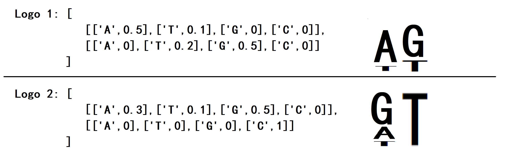
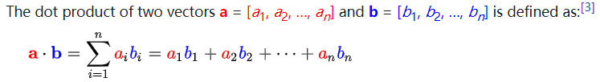
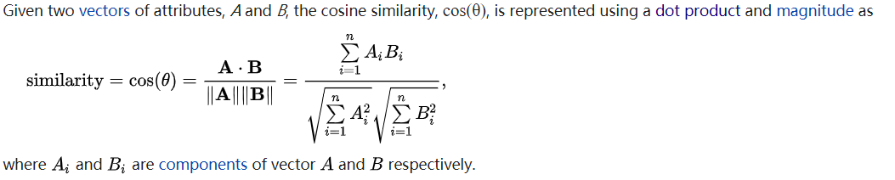
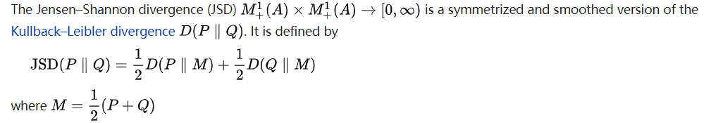
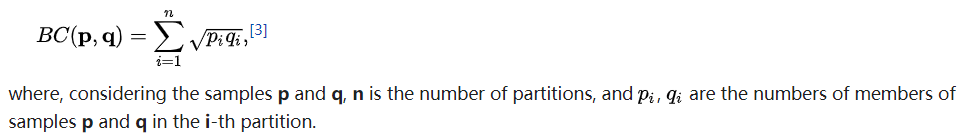
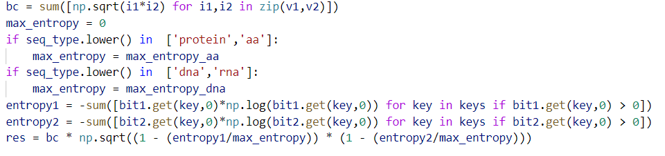
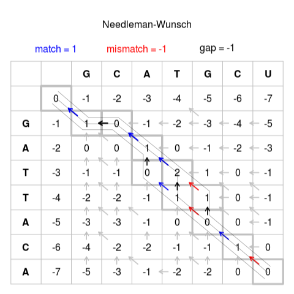

# Logo Alignment

MetaLogo could align sequence logos to highlight similar patterns between different groups. The alignment is like DNA sequence alignment, except that logo alignment compares two bit vectors (or probability vectors) from different positions of two or more logos, while sequence alignment compares two DNA bases from different sequences.

A schematic example is blow.

For alignment, we need to measure the similarities among positions from two logos. Actually we need to measure vector similarities. MetaLogo supports four kinds of measurement for vector similarities, including dot_product,js_divergence,cosine and entropy_bhattacharyya.

Dot product is also called inner product. The dot product of two vectors is defined as follows (from [wikipedia](https://en.wikipedia.org/wiki/Dot_product)):

Cosine similarity is also a popular measure of similarity. See the definition below (from [wikipedia](https://en.wikipedia.org/wiki/Cosine_similarity)).

Dot product and cosine similarity are all based on bits ([information content](https://en.wikipedia.org/wiki/Sequence_logo)) vectors of sequences. However, since we could base frequency as probability, we can measure similarities among probability vectors. Jensen–Shannon divergence ([wikipedia](https://en.wikipedia.org/wiki/Jensen%E2%80%93Shannon_divergence)) is a method of measuring the similarity between two probability distributions. It uses the Kullback Leibler divergence(The relative entropy) formula in order to find the distance.

Another similarity measurement is the Bhattacharyya coefficient. The Bhattacharyya coefficient is an approximate measurement of the amount of overlap between two statistical samples. The coefficient can be used to determine the relative closeness of the two samples being considered (wikipedia[https://en.wikipedia.org/wiki/Bhattacharyya_distance]).

However, we should consider the entropy of vectors when we measure similarity based on probabilities. If one probability vector is [['A',0.25],['T',0.25],['G',0.25],['C',0.25]], which means on this position, each base have a 1/4 frequency. In this scenario, bases are randomly distributed here on this position. Two vectors like this could get a high similarity, which means no conservation at all. Thus, we adjust Bhattacharyya coefficient by considering entropy of vector to it. Below is codes for entropy adjusted Bhattacharyya coefficient.

After we choose a similarity measurement for bits or probabilities vectors, we could perform sequence logo alignment. For pairwise logo alignment, MetaLogo uses a [Needleman–Wunsch algorithm](https://en.wikipedia.org/wiki/Sequence_alignment), which is an algorithm used in bioinformatics to align protein or nucleotide sequences. Below figure shows the process of Needleman-Wunsch algorithm. 

In MetaLogo, each item in column and row headers is a bits vector or probabilities vector.

For multiple sequence logo alignment, MetaLogo uses a [progressive technique](https://en.wikipedia.org/wiki/Multiple_sequence_alignment) first developed by Da-Fei Feng and Doolittle in 1987. MetaLogo first choose the most similar logos and align them with gaps inserted, then find the most similar logo to the aligned logos and align the new logo to the aligned logos, and repeat. More details could be found in MetaLogo source code.