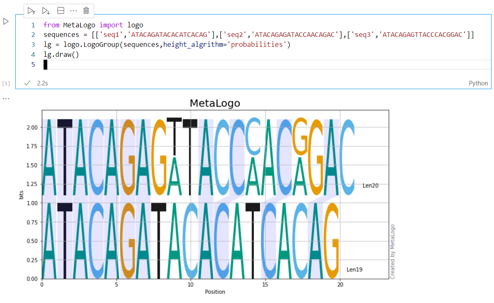
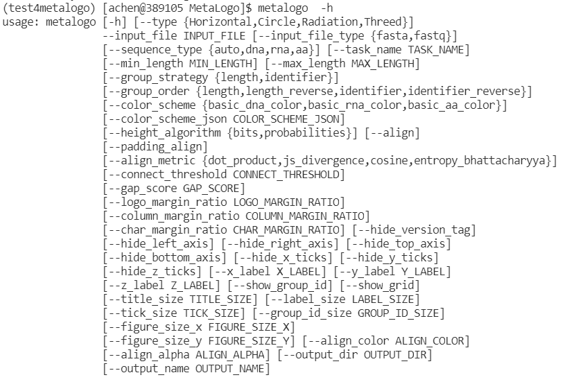

## Install MetaLogo

MetaLogo was written in Python in Linux. If you are using Windows, you could try MetaLogo in the Windows SubSystem for Linux to make sure no unexpected errors occured when using MetaLogo to make sequence logos. 

Before install MetaLogo, you could create a new virtual python enviroment for MetaLogo, which could make it easy for you to manage python packages by isolating them from others. However, this is a optional step.

    $conda create -n metalogo python=3.7
    $conda activate metalogo

Then please clone the MetaLogo repository to your local environment and excute following commands:

    $git clone https://github.com/labomics/MetaLogo .
    $cd MetaLogo
    $pip install .

After install, you can import MetaLogo in your scripts or notebook like below:

You can also call MetaLogo by directly type metalogo in your terminal:

If you don't want to install MetaLogo package or commands to your system, you could run the entrypoint script directly after installing all the requirements:

    $pip install -r requirements.txt
    $python -m MetaLogo.entry -h

MetaLogo also provides webserver to conviniently make sequence logos. The MetaLogo webserver was developed by using [Dash](https://dash.plotly.com/), which is a ligthweight tool for python apps development. For a temporary webserver for interactive operations, you need to install server related packages first by using following commands:

    $pip install .[webserver]

User can specify several options for MetaLogo webserver in server.toml file.

    $ cat server.toml 
        # This is a TOML document
        title = "MetaLogo webserver configure example"
        example_path = 'examples'  #directory for server to load exammple sequences from
        output_png_path = 'figure_output'  #directory to save figures
        output_fa_path = 'sequence_input'  #directory to save sequences
        config_path = 'configs' #directory to save configures for sequnce logos
        log_path = 'logs'  #directory to save logs
        max_seq_limit = 50000  
        max_seq_len = 200
        max_input_size = 5242880  #1024*1024*5, 5MB

Then you could run a development Dash webserver with Debug mode on:

    $cat server.dev.sh
     python -m server.main
    $sh server.dev.sh
     Dash is running on http://127.0.0.1:8050/
     * Serving Flask app 'main' (lazy loading)
     * Environment: production
     WARNING: This is a development server. Do not use it in a production deployment.
     Use a production WSGI server instead.
     * Debug mode: on

A MetaLogo webserver will be like:
    

For a production server, you can build a docker container to provide the service:

    $cat server.docker.sh
     docker build -t metalogo:v1 .
     docker run -d  --expose 8050 --name metalogo -e VIRTUAL_HOST=metalogo.omicsnet.org -v "$(pwd)":/code metalogo:v1 
    $sh server.docker.sh
     ...
    $docker ps
     CONTAINER ID    IMAGE          COMMAND                  CREATED      STATUS      PORTS       NAMES
     ad598ca936df    metalogo:v1    "/bin/sh -c 'GUNICORN"   2 days ago   Up 2 days   8050/tcp    metalogo

Docker needs to be installed in the system before run the command. This command will build the Docker image and start a Docker container. You could set a [nginx-proxy](https://github.com/nginx-proxy/nginx-proxy) layer to redirect network requests to MetaLogo container or you can just simply use the MetaLogo docker to recieve outside network traffic from your local network.

