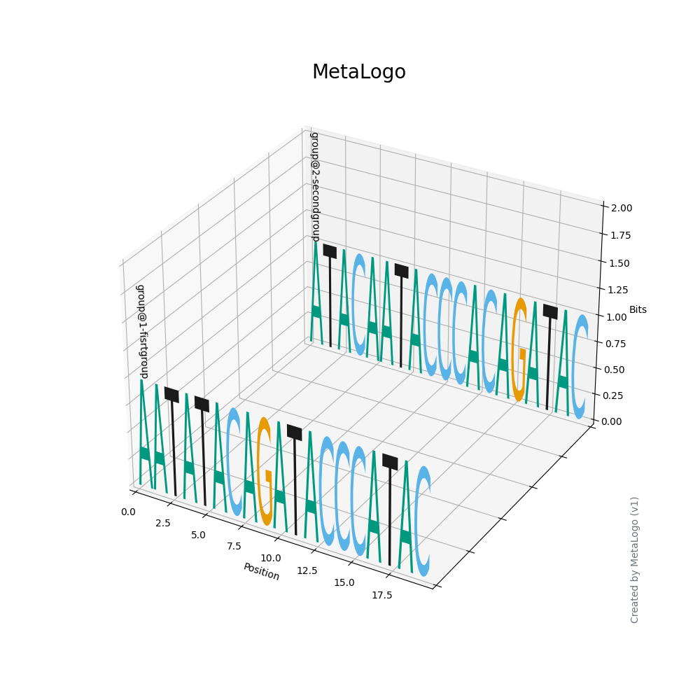
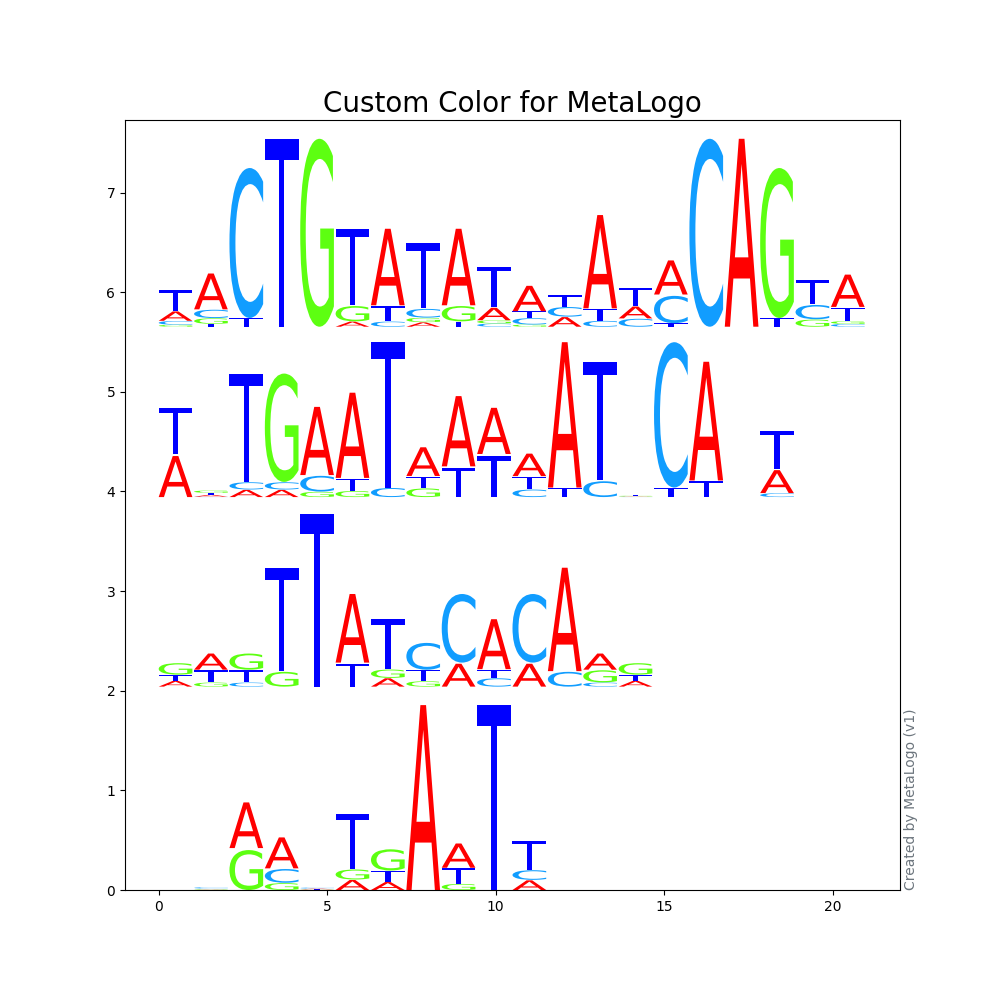
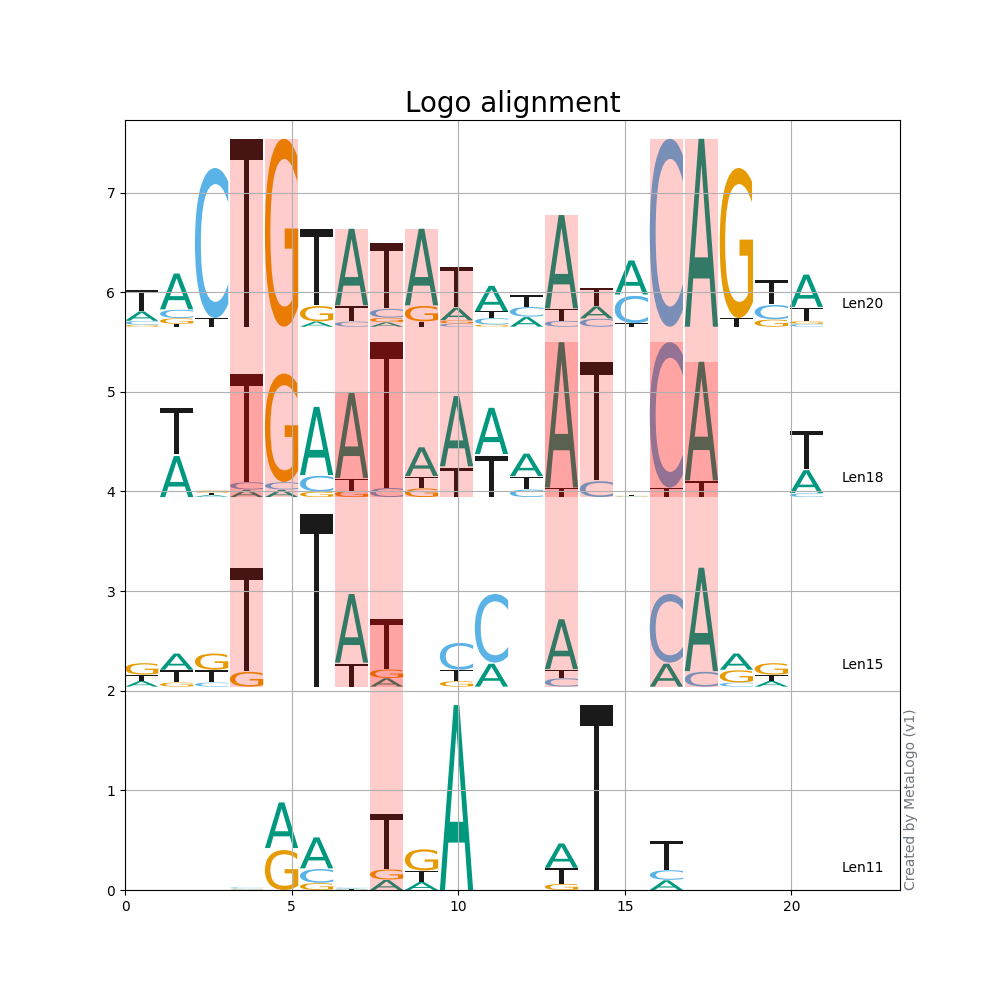
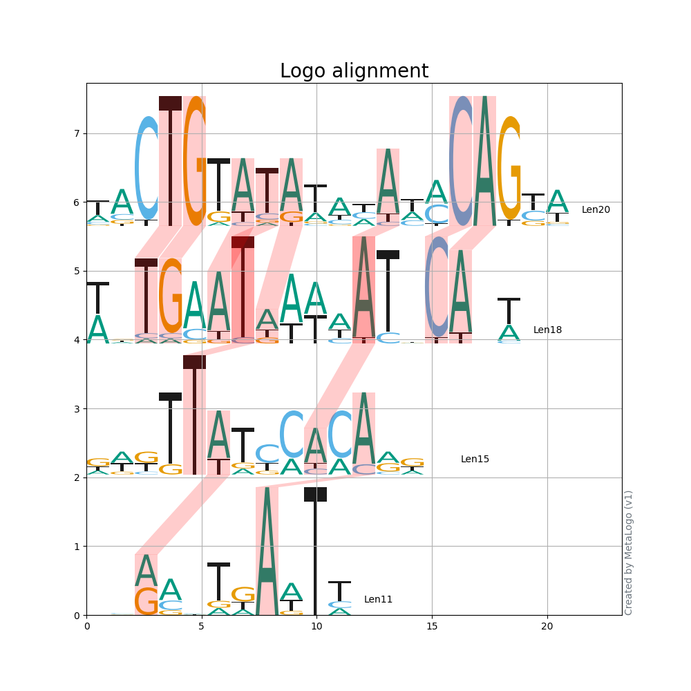
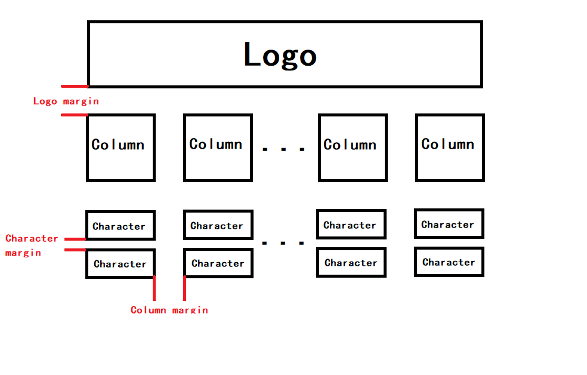
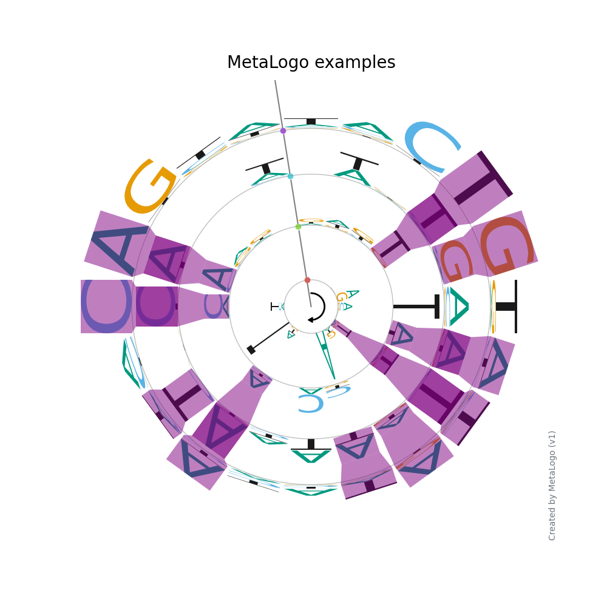
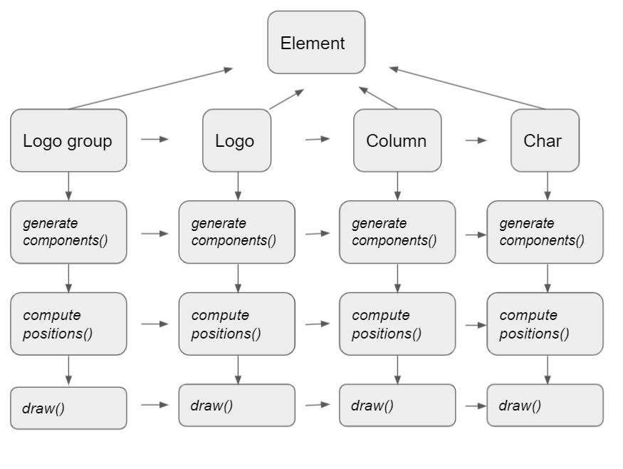
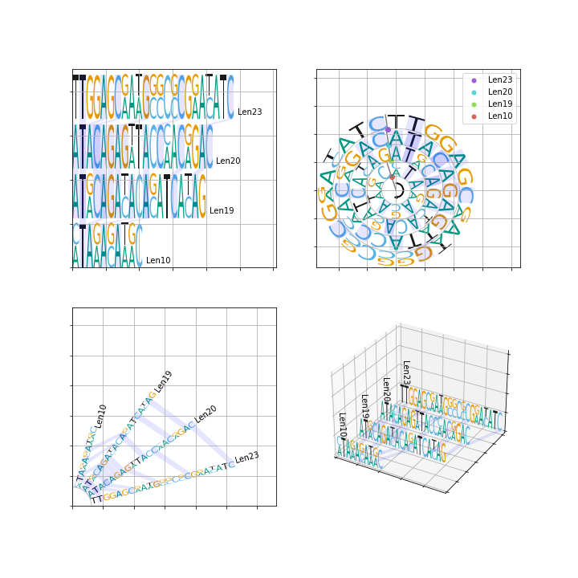

# MetaLogo Python Package

MetaLogo provides stand alone package for user to draw figures in their own computer or server. There are two ways to make sequence logos using MetaLogo package. One is importing MetaLogo into your python scripts and create logos with specific parameters, the other is directly execute MetaLogo in system terminal and pass arguments into MetaLogo to custom the logos. These two ways share the same set of parameters, which we will explain in this tutorial.


## Run MetaLogo in your terminal 

When you installed MetaLogo, you can run MetaLogo in your terminal like this:

    $ metalogo --input_file examples/test.fa --output_dir . --output_name test.png

If you do not want to install MetaLogo as a package in your system, you can also directly run MetaLogo like below:

    $ python -m MetaLogo.entry --input_file examples/test.fa --output_dir . --output_name test.png

Make sure you have install all the requirements and be under MetaLogo project directory.

If the command run successfully, you will get a plot named test.png in your current directory. 

Below are the parameters you can pass into MetaLogo.

    usage: metalogo [-h] [--type {Horizontal,Circle,Radiation,Threed}]
                    --input_file INPUT_FILE [--input_file_type {fasta,fastq}]
                    [--sequence_type {dna,rna,aa}] [--task_name TASK_NAME]
                    [--min_length MIN_LENGTH] [--max_length MAX_LENGTH]
                    [--group_strategy {length,identifier}]
                    [--group_order {length,length_reverse,identifier,identifier_reverse}]
                    [--color_scheme {basic_dna_color,basic_rna_color,basic_aa_color}]
                    [--height_algrithm {bits,probabilities}] [--align]
                    [--padding_align]
                    [--align_metric {dot_product,js_divergence,cosine,entropy_bhattacharyya}]
                    [--connect_threshold CONNECT_THRESHOLD]
                    [--gap_score GAP_SCORE]
                    [--logo_margin_ratio LOGO_MARGIN_RATIO]
                    [--column_margin_ratio COLUMN_MARGIN_RATIO]
                    [--char_margin_ratio CHAR_MARGIN_RATIO] [--hide_version_tag]
                    [--hide_left_axis] [--hide_right_axis] [--hide_top_axis]
                    [--hide_bottom_axis] [--hide_x_ticks] [--hide_y_ticks]
                    [--hide_z_ticks] [--x_label X_LABEL] [--y_label Y_LABEL]
                    [--z_label Z_LABEL] [--show_group_id] [--show_grid]
                    [--title_size TITLE_SIZE] [--label_size LABEL_SIZE]
                    [--tick_size TICK_SIZE] [--group_id_size GROUP_ID_SIZE]
                    [--figure_size_x FIGURE_SIZE_X]
                    [--figure_size_y FIGURE_SIZE_Y] [--align_color ALIGN_COLOR]
                    [--align_alpha ALIGN_ALPHA] --output_dir OUTPUT_DIR
                    [--output_name OUTPUT_NAME]

    optional arguments:
      -h, --help            show this help message and exit
      --type {Horizontal,Circle,Radiation,Threed}
                            Choose the layout type of sequence logo (default:
                            Horizontal)
      --input_file INPUT_FILE
                            The input file contain sequences (default: None)
      --input_file_type {fasta,fastq}
                            The type of input file (default: fasta)
      --sequence_type {dna,rna,aa}
                            The type of sequences (default: dna)
      --task_name TASK_NAME
                            The title to displayed on the figure (default:
                            MetaLogo)
      --min_length MIN_LENGTH
                            The minimum length of sequences to be included
                            (default: 8)
      --max_length MAX_LENGTH
                            The maximum length of sequences to be included
                            (default: 20)
      --group_strategy {length,identifier}
                            The strategy to seperate sequences into groups
                            (default: length)
      --group_order {length,length_reverse,identifier,identifier_reverse}
                            The order of groups (default: length)
      --color_scheme {basic_dna_color,basic_rna_color,basic_aa_color}
                            The color scheme (default: basic_dna_color)
      --height_algrithm {bits,probabilities}
                            The algrithm for character height (default: bits)
      --align               If show alignment of adjacent sequence logo (default:
                            False)
      --padding_align       If padding logos to make multiple logo alignment
                            (default: False)
      --align_metric {dot_product,js_divergence,cosine,entropy_bhattacharyya}
                            The metric for align score (default: dot_product)
      --connect_threshold CONNECT_THRESHOLD
                            The align threshold (default: 0.8)
      --gap_score GAP_SCORE
                            The gap score for alignment (default: -1.0)
      --logo_margin_ratio LOGO_MARGIN_RATIO
                            Margin ratio between the logos (default: 0.1)
      --column_margin_ratio COLUMN_MARGIN_RATIO
                            Margin ratio between the columns (default: 0.05)
      --char_margin_ratio CHAR_MARGIN_RATIO
                            Margin ratio between the chars (default: 0.05)
      --hide_version_tag    If show version tag of MetaLogo (default: False)
      --hide_left_axis      If hide left axis (default: False)
      --hide_right_axis     If hide right axis (default: False)
      --hide_top_axis       If hide top axis (default: False)
      --hide_bottom_axis    If hide bottom axis (default: False)
      --hide_x_ticks        If hide ticks of X axis (default: False)
      --hide_y_ticks        If hide ticks of Y axis (default: False)
      --hide_z_ticks        If hide ticks of Z axis (default: False)
      --x_label X_LABEL     The label for X axis (default: None)
      --y_label Y_LABEL     The label for Y axis (default: None)
      --z_label Z_LABEL     The label for Z axis (default: None)
      --show_group_id       If show group ids (default: False)
      --show_grid           If show background grid (default: False)
      --title_size TITLE_SIZE
                            The size of figure title (default: 20)
      --label_size LABEL_SIZE
                            The size of figure xy labels (default: 10)
      --tick_size TICK_SIZE
                            The size of figure ticks (default: 10)
      --group_id_size GROUP_ID_SIZE
                            The size of group labels (default: 10)
      --figure_size_x FIGURE_SIZE_X
                            The width of figure (default: 10)
      --figure_size_y FIGURE_SIZE_Y
                            The height of figure (default: 10)
      --align_color ALIGN_COLOR
                            The color of alignment (default: 10)
      --align_alpha ALIGN_ALPHA
                            The transparency of alignment (default: 10)
      --output_dir OUTPUT_DIR
                            Output path of figure (default: .)
      --output_name OUTPUT_NAME
                            Output name of figure (default: test.png)

Most of the parameters are easy to understand, there are several parameters need to be explained here.

      --group_strategy {length,identifier}
                            The strategy to seperate sequences into groups
                            (default: length)

This parameter specifiy the way you group sequences. In default, MetaLogo groups sequences by lengths. However, you could still group sequences by other strategy.  MetaLogo can identify group information of sequences from their sequnce name. Blow is a example:

    >seq1 group@1-fisrtgroup
    AATATACAGATACCCATAC
    >seq2 group@2-secondgroup
    ATACAATACCCACAGATAC

You need to add a **'group@\d-\S'** pattern in your sequence names. In the term, 'group@' is fixed and then followed by a number, a dash and a string to indicate group information. Then if you set **--group_strategy** as **'identifier'**, MetaLogo will draw sequence logos for different groups. It should be noted that in each group, lengths of sequences must be the same.  Below is a output of identifier-grouped input (probabilities as height, 3D layout):




    --group_order {length,length_reverse,identifier,identifier_reverse}
                  The order of groups (default: length)

This parameter specify how to order the groups. 'length' means sorting groups by sequence lengths, 'length_reverse' means sorting groups by sequence lengths in a decreasing order, 'identifier' means sorting groups by its group id indicated in sequence names, i.e. the number followed 'group@' term in sequence name, 'identifier_reverse' means a decreasing order. 

    --max_length, --max_length

These two parameters specify the length of sequences to be included in the logo drawing process. Sometimes the length range of sequences could be too large for visualization, users could limit the lengths of sequences for sequence logos.

    --color_scheme

This parameter specify the color scheme for sequence logo. There are four built-in schemes, namely *basic_dna_color,basic_rna_color,basic_aa_color*. User can also pass a json format of a python dict into color scheme. Below is a example:

    $ cat color.json 
    {"A": "red", "T": "blue", "G": "#5dff11", "C": "#119dff"}
    $ metalogo --input_file examples/ectf.fa --color_scheme_json color.json --task_name 'Custom Color for MetaLogo'





    --height_algrithm {bits,probabilities}
                      The algrithm for character height (default: bits)

This parameter tells MetaLogo to use probabilities or information contents for y axis in sequence logos. If there is only one sequence in one group, the information contents of each positions equal to zeros because error correction. This is the reason why we sometimes use probabilities as height in our tutorial. 

    --align               If show alignment of adjacent sequence logo (default: False)

When you pass this parameter to MetaLogo, it will tried to align each pair of groups according to your group order. 

    --padding_align       If padding logos to make multiple logo alignment
                          (default: False)

This parameter will make MetaLogo perform multiple logo alignment for all the groups rather than only for two adjacent groups.


    --align_metric {dot_product,js_divergence,cosine,entropy_bhattacharyya}
                    The metric for align score (default: dot_product)

This parameter specify the algrithm to measure position similarities between sequence logos. Detailed information could be found in our paper.


    --connect_threshold CONNECT_THRESHOLD
                        The align threshold (default: 0.8)

This parameter specify the threshold to connect two postions between two adjcent groups according to logo alignment. If this threshold is positive (>0), MetaLogo will connect two positions if their similarity score is larger than the threshold. If this threshold is negative (>0), MetaLogo will connect two positions if their similarity score is in the top (ratio\*100)% of all pairs, in which ratio equals to -1\*threshold.

    --align_color ALIGN_COLOR
                          The color of alignment (default: 10)
    --align_alpha ALIGN_ALPHA
                          The transparency of alignment (default: 10)

These two parameter specify the color and transparency of connections between logos.

Below is a example for logo alignment. 

    $ metalogo --input_file examples/ectf.fa   --show_group_id --align --padding_align --connect_threshold -0.3 --task_name 'Logo alignment' --show_grid



Below is a example for logo alignment without global multiple logo alignment and padding. 

    $ metalogo --input_file examples/ectf.fa   --show_group_id --align  --connect_threshold -0.3 --task_name 'Logo alignment' --show_grid



    --logo_margin_ratio LOGO_MARGIN_RATIO
                          Margin ratio between the logos (default: 0.1)
    --column_margin_ratio COLUMN_MARGIN_RATIO
                          Margin ratio between the columns (default: 0.05)
    --char_margin_ratio CHAR_MARGIN_RATIO
                          Margin ratio between the chars (default: 0.05)

These three parameters specify the proportional margins between different items. 




Other parameters are easy to understand according to their names. Most of them are helpful for users to plot custom sequence logos.

Below are a simple example.

    $ metalogo --input_file examples/ectf.fa  --align  --connect_threshold -0.3 --align_color 'purple' --align_alpha 0.5 --padding_align --task_name 'MetaLogo examples' --type Circle --hide_x_ticks --hide_y_ticks --hide_left_axis --hide_right_axis --hide_top_axis --hide_bottom_axis 




## Import MetaLogo into your scripts

After install MetaLogo as a python package, you can import MetaLogo into your scripts or notebook easily. Below is a simple example.

```python
    from MetaLogo import logo
    sequences = [['seq1','ATACAGATACACATCACAG'],['seq2','ATACAGAGATACCAACAGAC'],['seq3','ATACAGAGTTACCCACGGAC']]
    lg = logo.LogoGroup(sequences,height_algrithm='probabilities')
    lg.savefig('test.png')
```

LogoGroup recieves nearly same parameters as standalone MetaLogo entrypoint we decribed above.

```python
    LogoGroup(self,  seqs, ax=None, group_order='length', group_strategy='length', start_pos = (0,0), 
              logo_type = 'Horizontal', init_radius=1, 
              logo_margin_ratio = 0.1, column_margin_ratio = 0.05, char_margin_ratio = 0.05,
              align = True, align_metric='sort_consistency', connect_threshold=0.8, 
              radiation_head_n = 5, threed_interval = 4, color = basic_dna_color, task_name='MetaLogo',
              x_label = 'Position', y_label = 'bits',z_label = 'bits', show_grid = True, show_group_id = True,
              hide_left_axis=False, hide_right_axis=False, hide_top_axis=False, hide_bottom_axis=False,
              hide_x_ticks=False, hide_y_ticks=False, hide_z_ticks=False, 
              title_size=20, label_size=10, tick_size=10, group_id_size=10,align_color='blue',align_alpha=0.1,
              figure_size_x=-1, figure_size_y=-1,gap_score=-1, padding_align=False, hide_version_tag=False,
              sequence_type = 'dna', height_algrithm = 'bits',
              *args, **kwargs):
```
 
 Only two differences are the way you pass sequences and color schemes. For sequences, you need to pass a sequence array into LogoGroup as the first positional parameter. In this sequence array, each item is a tuple of sequence name and its dna or protein sequence.  For color scheme, here you need to pass a python dict into LogoGroup rather than any name string or json formatted dict. 

For the structure of MetaLogo, the following figure indicate the class inheritance and method execution order when drawing a MetaLogo.



When you using MetaLogo in your project, you could get the ax object of matplotlib as follows:

```python
    lg = logo.LogoGroup(sequences,height_algrithm='probabilities')
    lg.draw()
    ax = logo.ax
```

Meanwhile, you could also pass ax to LogoGroup init function when you create LogoGroup instance. Blow is a example.
```python
    import matplotlib.pyplot as plt
    from MetaLogo import logo

    sequences = [
                    ['seq1','ATACAGATACACATCACAG'],
                    ['seq2','ATGCAGACACAGATCATAG'],
                    ['seq3','ATACAGAGATACCAACAGAC'],
                    ['seq4','ATACAGAGTTACCCACGGAC'],
                    ['seq5','TTGGAGCGATGCGCCCGGACATC'],
                    ['seq6','TTGGAGCAAAGGCCGCGAATATC'],
                    ['seq7','CTAGAGATGC'],
                    ['seq8','ATAAACAAAC'],
                ]

    ax1 = plt.subplot(221)
    ax2 = plt.subplot(222)
    ax3 = plt.subplot(223)
    ax4 = plt.subplot(224,projection='3d')

    paras = {
        'height_algrithm':'probabilities',
        'align':True,
        'padding_align':True,
        'task_name':'',
        'xlabel':'',
        'ylabel':'',
        'hide_version_tag':True
    }
    lg_horizontal = logo.LogoGroup(sequences,logo_type='Horizontal',ax=ax1,**paras)
    lg_circle = logo.LogoGroup(sequences,logo_type='Circle',ax=ax2,**paras)
    lg_radiation = logo.LogoGroup(sequences,logo_type='Radiation',ax=ax3,**paras)
    lg_3d = logo.LogoGroup(sequences,logo_type='Threed',ax=ax4,**paras)

    lg_horizontal.draw()
    lg_circle.draw()
    lg_radiation.draw()
    lg_3d.draw()
```

 