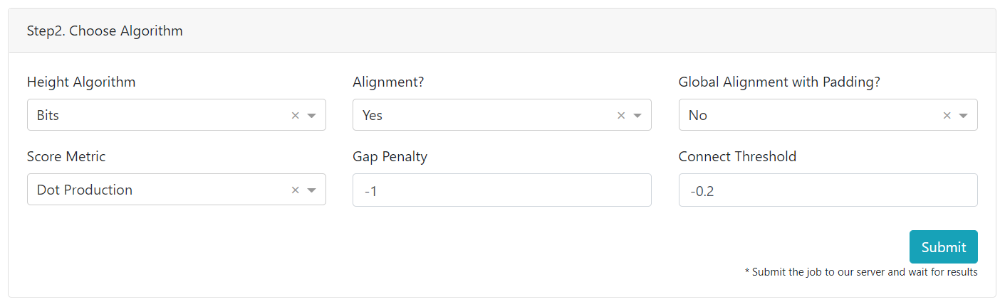

# MetaLogo WebServer

MetaLogo provides a public webserver for users. Users can also deploy their own MetaLogo server in their local network. In this tutorial, we will explain how to use MetaLogo webserver without coding.

First you need to visit http://metalogo.omicsnet.org (could be http://localhost:8050 if you deploy MetaLogo in your own compute), then you will see the following page if nothing goes wrong.

Just as the top menu indciated, you could visit the tutorial, python packages, Journal paper, our Lab website and email us from the top menu.

## Step1. Input Panel

There are in total six panels in the rest of MetaLogo website. The first one is a About panel which describes MetaLogo briefly. The second panel is a Input panel. You could input your data in this panel.

For **Input Format**, you could choose from *Fasta* and *Fastq* formats. For **Sequence Type**, you could choose from *Auto*, *DNA*, *RNA* or *protein*. The term *Auto* means MetaLogo will automatically detect the sequence type. Note that if you choose the right sequence type, you need to make sure that your input sequences only involve in valid bases.  

For **Grouping By**, you could choose from *Length* and *Seq identifier*, which specify the grouping strategy in your multiple sequence logos. If you choose *Length*, MetaLogo will group sequences you input according to their lengths; if you choose *Seq identifier*, MetaLogo will identify the group information of each sequence by checking their sequence name to find a patter like **group@number-name**. Below is a valid example:

    >seq1 group@1-firstgroup
    ATACAGACAGAGACACAG
    >seq1 group@2-secondgroup
    ATACAGACAGAGACACAG

Note that in each group, sequence lengths should be the same.

**Minimum Length** and **Maximum Length** specify which sequences with certain lengths to be included for making sequence logo.

Users can paste sequences into the textarea or upload a sequence file. Note that for our public MetaLogo webserver, sequence number and file size are limited because of limited computational resources. When user deploy their own MetaLogo server, they can easily adjust these limitations to a acceptable degree.

Users can simply load examples by clicking **Load example** or **example2** to load example sequences into textarea, then test and get familiar with MetaLogo.

In Input panel, you can directly submit the job request and just skip the rest parameter settings to get a Logo with default layout and algrithms.

## Step2. Algrithm Panel

In this panel, users can specify the algrithms to make logos and logo alignment. Before specify parameters in this section, users need to check the Alignment tutorial first.

For **Height Algrithm**, user can choose *Bits* or *Probabilities*, which tells MetaLogo how to display sequence logos in the final plot. 

For **Alignment?**, user can choose *Yes* or *No*, which tells MetaLogo whether to align adjacent sequence logos from different groups.

For **Global Alignment with Padding?**, user can choose *Yes* or *No*, which tells MetaLogo whether to make a global multiple logos alignment and align all logo to a same length with padding inserted into logos.

For **Score Metric**, user can choose from *Dot Production*, *Jensen Shannon*, *Cosine* and *Entropy weighted Bhattacharyya Coefficient*. For explainations please check the Alignment tutorial first. 

For **Gap Penalty**, user can specify the gap penalty in the logo alignment process. If you set a small penalty, like 0, MetaLogo will insert gaps as much as possible. In contrast, if you set a large penalty, like -10, MetaLogo will hate gaps and avoid them as much as possible. Below is a explained figure.

For **Connect Threshold**, the default value is -0.2. This threshold will not affect the alignment process, but it guide MetaLogo to choose and connect certain pairs of aligned positions from two adjacent logos according their alignment. If this threshold is positive (>0), MetaLogo will connect positions with a similarity larger than the threshold. If this threshold is negative (<0), MetaLogo will connect the top (ratio\*100)% of all paris of aligned positions between two adjacent logos ranked by similarities, where ratio equals -1\*threshold. Below is a explained example.

## Step3. Layout Panel

In this panel, users can choose different layout for their logo groups. There are in total four different layouts, including **Horizontal**, **Circular**, **Radial** and **3D**. Below is a collection:

For **Sort By**, users can specify the group order of logos. *Length* means MetaLogo will sort logos by sequence lengths; *Length_reverse* means MetaLogo will sort logos by sequence lengths but in a descending manner; *Group Id* means MetaLogo will sort logos by group names indicated by sequence names; *Group Id* leads to a descending manner.

For **Logo Margin Ratio**, **Column Margin Ratio** and **Character Margin Ratio**, they specify the relative distances between items. These parameters all represent relative distances, if you set **Logo Margin Ratio** to 0.1, you will get a 1cm distance between logos when the logo heigth is 10cm. Below is a explained example.

## Step4. Style Panel

In this panel, you could specify lots of parameters to customize your MetaLogo sequence logos. Most of them are easy to understand. 

For **Alignment Color**, users could choose the color for MetaLogo to connect or highlight similarly aligned positions. **Alignment Transparency** specify the transparency of these connects.

For **Color Scheme**, users could choose the built-in scheme like *DNA Basic*, *RNA Basic* and *Protein Basic*. Users can also customize their own color scheme by assigning each base a color through our color picker widgets. RGB, HSL and HEX are supported for color picker.

Note that all color settings are stored in the local storage of your web browser, so you can feel free to refresh MetaLogo web without worried about losing your carefully chosen color schemes.

For **Download Format**, MetaLogo provides *PNG*, *PDF*, *PS*, *EPS* and *SVG* formats for users to download. 

## Result Panel

In this Panel, MetaLogo displays result figure and download button for user to download their request format of figure.